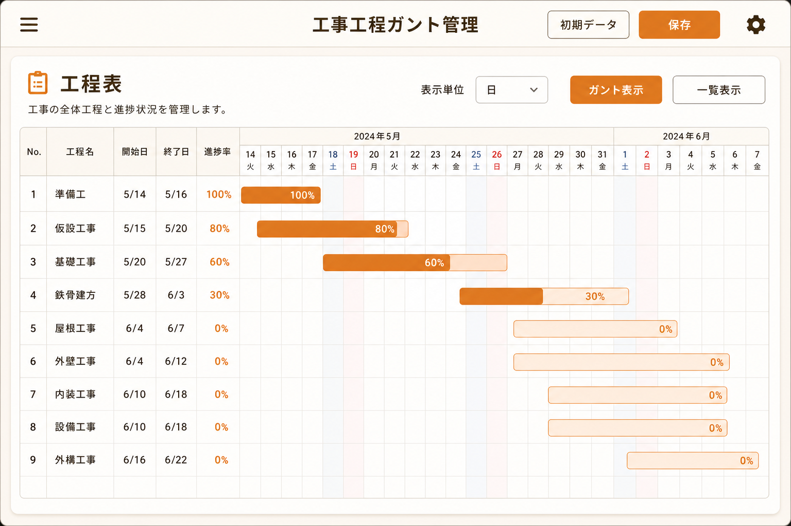
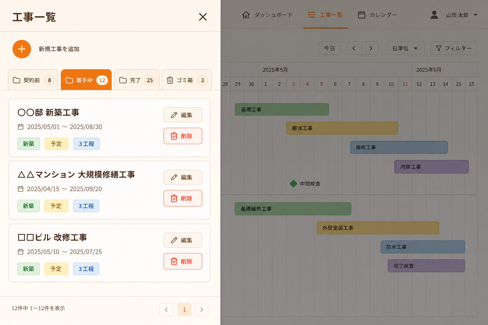
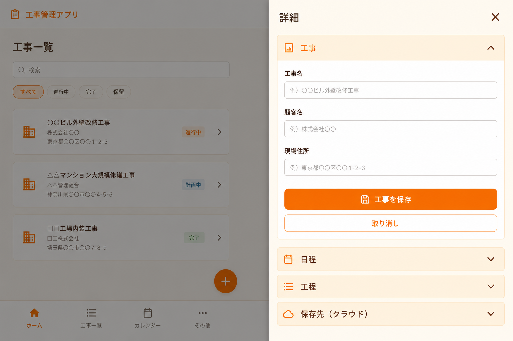
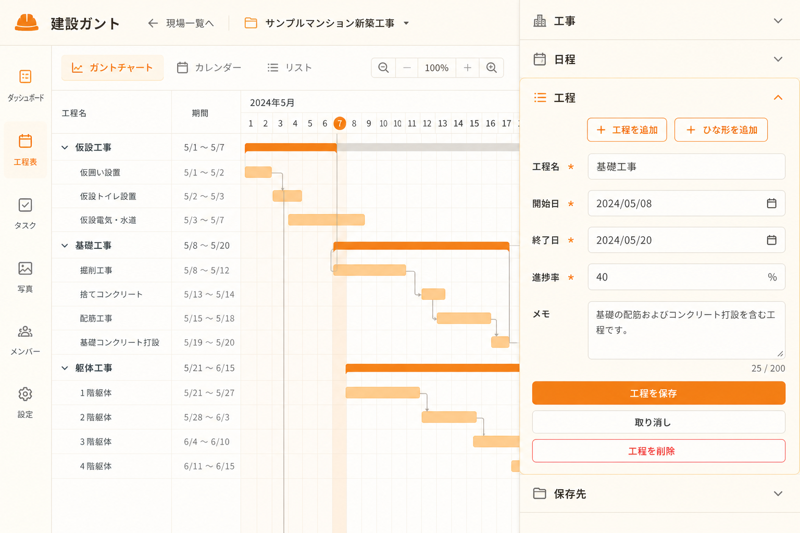
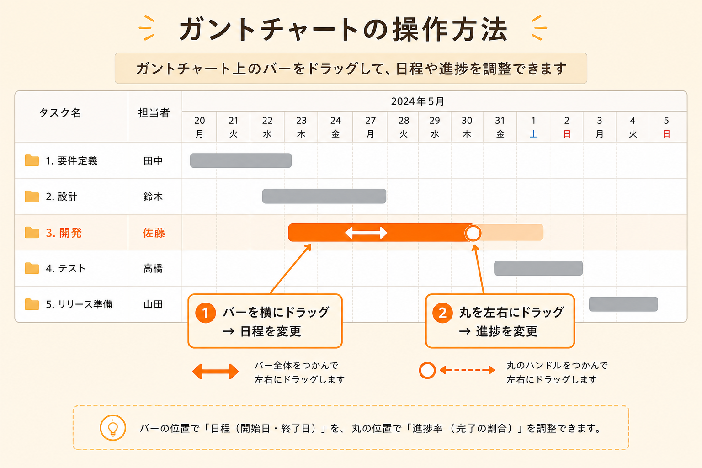
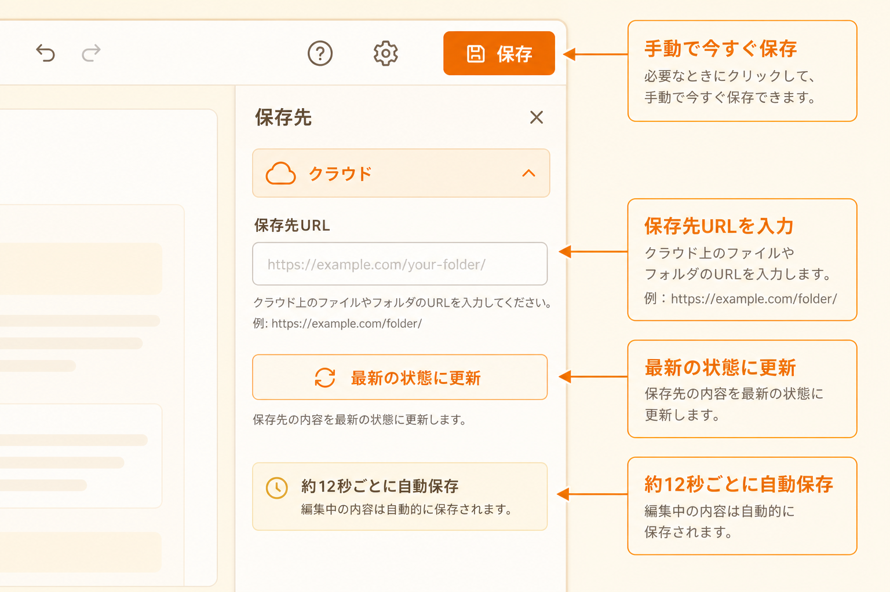

# 工事工程ガント管理 — 簡易操作手順書

> **ご注意**  
> 本書に掲載している画面画像は、操作のイメージを伝えるための**モックアップ（イメージ図）**です。  
> 実際の画面と細部が異なる場合があります。実画面のスクリーンショットに差し替える場合は、各「図○」の位置に画像を置き換えてください。

---

## 1. このアプリでできること

このアプリは、**工事ごとの工程表（ガントチャート）**を見ながら、日程や進捗を管理するためのツールです。

- 複数の工事をフォルダ（契約前・着手中・完了・ゴミ箱）で整理
- 工程の追加・編集・削除
- ガント上で日程や進捗をドラッグ操作
- 一定時間ごとの自動保存と、手動の「保存」ボタン
- クラウド（Google スプレッドシート連携）での共有（保存先URLを設定した場合）

---

## 2. 画面の見かた

**図1：全体画面**

| 場所 | 名称 | 説明 |
|------|------|------|
| 画面上部 | トップバー | 左の **☰** で工事一覧、右の **⚙** で詳細設定を開きます |
| 中央 | 工程表（ガント） | 選択中の工事の工程が横棒で表示されます |
| 右上 | 表示切替 | **表示単位**（日／週／月）、**ガント表示**／**一覧表示** |
| 右上 | **保存** | 手動で今すぐ保存します（詳細は「8. 保存とクラウド共有」） |

---

## 3. 工事を選ぶ・追加する

**図2：左ドロワー（工事一覧）**

### 工事を選ぶ

1. 画面左上の **☰** を押す
2. フォルダタブ（**契約前** / **着手中** / **完了** / **ゴミ箱**）から見たい区分を選ぶ
3. 一覧の工事名をタップ／クリックする
4. 中央の工程表に、その工事の工程が表示されます

### 新しい工事を追加する

1. **☰** で左ドロワーを開く
2. **＋** ボタンを押す
3. 右ドロワーが開き、「工事」セクションで名前などを入力
4. **工事を保存** を押す

### 工事の編集・削除

- **編集** … その工事を選択し、右ドロワーの「工事」セクションを開く
- **削除** … 左ドロワーの **削除** でゴミ箱へ移動（工程データは残ります）

---

## 4. 工事情報・日程を変更する

**図3：右ドロワー（工事・日程）**

### 右ドロワーを開く

- 画面右上の **⚙** を押す  
  （前回開いていたセクションの状態がそのまま残ります）

### 工事情報を変更する

1. **工事** セクションを開く
2. 工事名・顧客名・現場住所などを入力
3. **工事を保存** を押す
4. 入力をやり直したい場合は **取り消し**（保存前の内容に戻ります）

### 着工日・完工日を変更する

1. **日程** セクションを開く
2. **着工予定日** / **完工予定日** を入力するか、**−** / **＋** で1日ずつ調整
3. 「着工日変更時、工程も同じ日数だけ移動」にチェックを入れると、工程もまとめてずらせます
4. **日程を反映** を押す

---

## 5. 工程を追加・編集・削除する

**図4：右ドロワー（工程）**

### 工程を追加する

1. 右ドロワーの **工程** セクションを開く
2. **工程を追加** を押す（新規入力欄が表示されます）
3. **工程名**・**開始日**・**終了日**・**進捗率**・**メモ** を入力
4. **工程を保存** を押す

**ひな形を追加** … よく使う工程セットを一括で追加します（既存の工程は残ります）。

### 既存の工程を編集する

次のいずれかで、編集対象の工程を選びます。

- ガント上の工程バーをクリック → **工程** セクションが開く
- **一覧表示** に切り替え、表の行をクリック → **工程** セクションが開く

内容を変更したら **工程を保存** を押します。**取り消し** で保存前の内容に戻せます。

### 工程を削除する

1. 削除したい工程を選択（上記と同様）
2. **工程を削除** を押し、確認ダイアログで OK

---

## 6. ガント上での直接操作

**図5：ガント操作（日程・進捗）**

| 操作 | やり方 | 結果 |
|------|--------|------|
| **日程を変える** | 工程バー**本体**を左右にドラッグ | 開始日・終了日が変わります |
| **進捗を変える** | バー右端の**丸い点**を左右にドラッグ | 進捗率（％）が変わります |

- 変更は自動的に記録され、一定時間後に保存されます
- 右ドロワーの **工程** セクションでも、数値を直接入力して **工程を保存** できます

---

## 7. 表示を切り替える

### 表示単位（日／週／月）

工程表上部の **表示単位** から選びます。工程の長さや見やすさに合わせて切り替えてください。

### ガント表示 ↔ 一覧表示

| ボタン | 内容 |
|--------|------|
| **ガント表示** | 横棒の工程表（日程の全体像を見る） |
| **一覧表示** | 表形式（工程名・日付・進捗などを一覧で見る） |

一覧の行をクリックすると、その工程の編集画面（**工程** セクション）が開きます。

---

## 8. 保存とクラウド共有

**図6：保存先（クラウド）**

### 自動保存

- 変更後、**約12秒** 経つと自動で保存されます（保存先URLが設定されている場合）
- ブラウザを閉じる前に、念のため **保存** を押すことをおすすめします

### 手動保存

- 画面右上の **保存** を押すと、**今すぐ** 保存します

### クラウド（共有）の設定

1. 右ドロワーの **保存先（クラウド）** セクションを開く
2. 管理者から共有された **保存先URL** を入力
3. **最新の状態に更新** で、他の端末の最新データを読み込めます

保存先URLが未設定の場合は、**この端末内** にのみ保存されます。

---

## 9. 削除・復元（ゴミ箱）

### 工事をゴミ箱へ移動

1. **☰** で左ドロワーを開く
2. 対象工事の **削除** を押す
3. ゴミ箱フォルダに移動します（工程データは保持されます）

### 工事を復元

1. 左ドロワーで **ゴミ箱** タブを選ぶ
2. 対象工事の **復元** を押す

### 完全削除

- ゴミ箱内の工事のみ **完全削除** が可能です  
- **元に戻せません**。工程データも削除されます

---

## 10. 困ったときに（FAQ）

### 工程表に何も表示されない

- 左ドロワー（**☰**）で工事を選んでいるか確認してください
- 工程が0件の場合は、**工程を追加** または **ひな形を追加** を使ってください

### 右ドロワーで「工事」ではなく「工程」を見たい

- ガント上の工程をクリックするか、**工程を追加** を押すと **工程** セクションが開きます
- **⚙** だけ押した場合は、前回開いていたセクションのままです

### 進捗や日程をドラッグしても動かない

- **日程** … バー**本体**をドラッグしてください（端の丸は進捗用です）
- **進捗** … バー右端の**丸い点**をドラッグしてください
- PC のマウス操作を想定しています。うまくいかない場合は右ドロワーから数値を入力してください

### 「取り消し」を押したあと、メッセージが見えない

- 画面右下に短時間表示されます。右ドロワーの前面に出るよう調整済みです

### 保存に失敗した／他の人が先に更新した

- **保存先（クラウド）** の **最新の状態に更新** で再読込してから、もう一度 **保存** してください
- 保存先URLが正しいか、管理者に確認してください

### 初期状態に戻したい

- トップバーの **初期データ** でサンプルデータを再読込できます  
- **現在の内容は上書きされます**。実行前に確認ダイアログが出ます

---

## 図一覧（差し替え用）

| 図番号 | ファイル名 | 内容 |
|--------|------------|------|
| 図1 | `images/01_全体画面.png` | 全体画面 |
| 図2 | `images/02_左ドロワー_工事一覧.png` | 左ドロワー（工事一覧） |
| 図3 | `images/03_右ドロワー_工事日程.png` | 右ドロワー（工事・日程） |
| 図4 | `images/04_右ドロワー_工程.png` | 右ドロワー（工程） |
| 図5 | `images/05_ガント操作.png` | ガント操作（日程・進捗） |
| 図6 | `images/06_保存先クラウド.png` | 保存先（クラウド） |

---

*工事工程ガント管理 — 簡易操作手順書（現場向け）*
